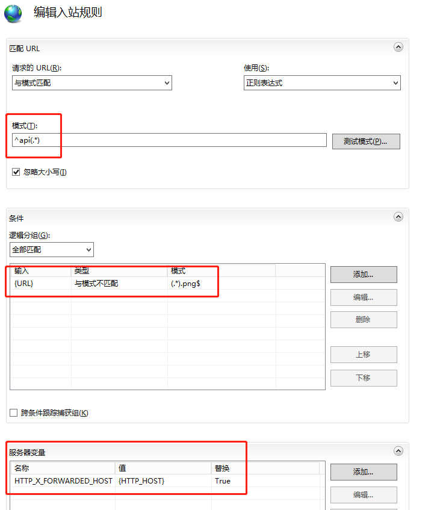
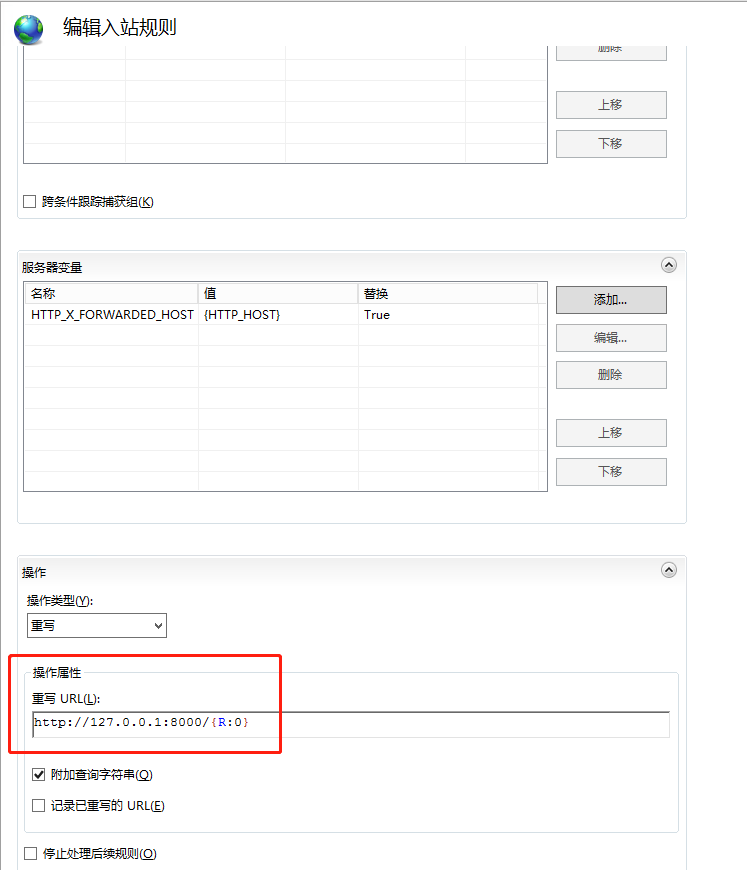

# 在 Windows Server 2012 R2 下部署

## 基础

需要提前安装并配置好下列软件

- [`git`](https://git-scm.com/)  - 代码管理工具
- [`postgresql`](https://www.postgresql.org/)  - 数据库 (建议安装10版本)
- [`node & npm`](https://nodejs.org/en/download/)  - npm 包管理工具
- [`python`](https://www.python.org/downloads/windows/) - 建议安装 3.7 版本
- `IIS` - windows server 自带的服务器管理系统

## Poython
安装的时候，有两个地方要特别注意，一是要勾选 `Add to PATH`，二是一定要把它安装到没有空格的路径下，比如 `c:\python37`

## PostgreSQL

需要建立一个数据库，来存储 `camel-store` 的数据。

文档中约定使用的数据库名为 `camelstore`，其为用户 `camelstore` 所有。

Windows Server 2012 与普通 windows 版本最大的不同，在于其文件 / 目录控制权限更严。所以在新建一个数据库的数据存放目录，比如 c:\pgsql\data, 右键点击文件夹，选择“属性”、“安全”、“编辑”、“Users”，把“完全控制”一行的“允许”选中。确认保存。

## git

1. 建议在 `C:\inetpub\wwwroot` 目录下，运行 `git clone https://github.com/gzqichang/camel-store.git --recurse-submodules` 把本仓库拉取到本地，记得需要加入 `--recurse-submodules` 参数。
1. 进入 `camel-store` 目录。

## api 部分

进入 `api` 目录。

1. 运行 `pip install -U pip setuptools pipenv` 安装升级包管理工具。

要安装各种依赖。

1. 运行 `pipenv sync` 安装虚拟环境。
1. 运行 `pipenv shell` 进入虚拟环境。
1. 运行一下 `django-admin version` 看看是不是 2.2 版本。目前我们还不支持 3.0 或更高版本。

`cd packages` 进入依赖包的目录，然后分别进入 `qapi`、`qcache`、`qsmstoken`、`quser` 目录，逐一运行 `python setup.py develop` 安装开发版本。

接下开始配置项目。

1. `cd conf/settings`
1. `copy local.py.tpl local.py` 生成本地配置环境。
1. 选择喜欢的编辑器，打开 `local.py` 文件，并把 `SECRET_KEY` 和 `DEFAULT_DB` 等项填好，记得 `SECRET_KEY` 要使用几十个字符的随机字符串。
1. 回退到 `api` 目录。
1. 运行 `python manage.py migrate` 创建各种数据表，然后运行
    1. `python manage.py init_staff` 创建初始用户数据
    1. `python manage.py format_groups` 创建初始分组数据
    1. `python manage.py updateconfig` 修改配置，相关的参数看一下帮助。
    1. `python manage.py wechatconfig` 修改配置，相关的参数看一下帮助。
    1. `python manage.py changepassword admin` 修改之前生成的 admin 账号的密码。
1. 运行 `python manage.py runserver` 跑起来看看。
    1. 打开浏览器，访问一下 `http://localhost:8000/api/sitemap/`, 如果可以看到 rest-framework 的界面，表示 api 已经正常运行。

## admin 部分

进入 `admin` 目录。

1. 运行 `npm install` 安装项目依赖的模块，这里视网络的情况，估计要一点时间。
1. 运行 `npm run build`，如果不成功，可以考虑在本地 `npm run build` 后将 `dist` 文件夹放入 `admin` 目录下。

## IIS
1. 在 `IIS` 中新建一个网站 (物理路径：`camel-store\admin\dist` 目录)，把域名分配过去就好。
1. 打开 `URL重写` 功能，右侧的 `操作` 下方点击打开 `查看服务器变量`，打开后在右侧的 `操作` 下方点击 `添加`，添加服务器变量，名称为：`HTTP_X_FORWARDED_HOST`。
1. 回到 `URL重写` 页面，右侧的 `操作` 下方点击打开 `添加规则`，选中 `入站规则` 中的 `空白规则`，配置如下图：

    

    

配置完成后，点击右侧的 `操作` 下方的 `应用`。

   1. 打开浏览器，访问 `http://camel-store-win.gzqichang.com/` 应该可以看到 admin 的登陆界面，输入账号密码，可以成功登陆。

---------------

至此，部署完成。