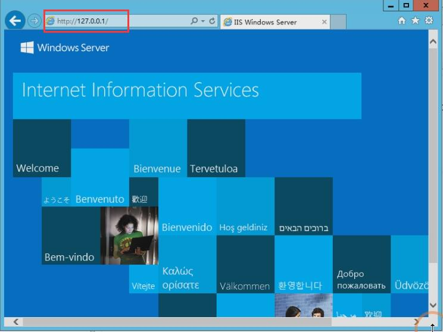
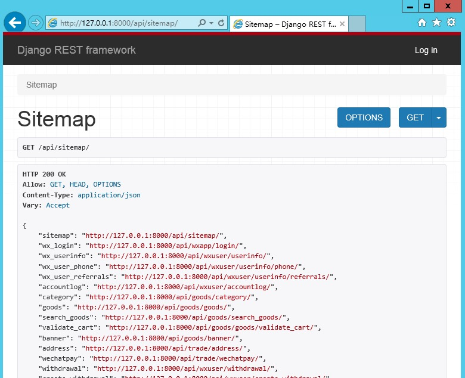

# 在 Windows Server 下部署生产环境

本文基于 Windows Server 2012 R2 和 IIS 8.5 编写，如果使用其他版本，请注意兼容性。

本文的配置方法至少要求 IIS 7。

本文所指的命令行一般是指`PowerShell`，用户应当熟悉其的一般操作。

## 基础

需要提前安装并配置好下列软件

### IIS

必须安装和启用 IIS，成功后打开浏览器访问 [http://127.0.0.1/](http://127.0.0.1/)，可以看到类似下图的页面表示已经安装和启用 IIS，反之则应先修正 IIS 的安装和启用。




### PostgreSQL

`camel-store`使用的数据库是`PostgreSQL`，暂时不支持`MySQL`等其他数据库。

建议使用10版本。

#### 安装

数据库有两种方式，一种是购买云厂商的云数据库，使用这种方式一般性能更好，也更简单，不过要开销会增加一些。每个厂商的云数据库购买方式大同小异，在此不详述。

这里讲述本机安装的`乞丐版`方式，首先去[`postgresql`](https://www.postgresql.org/)官网下载适合你服务器的安装包，然后一路next，无惊无险安装完成。

Windows Server 2012 与普通 windows 版本最大的不同，在于其文件 / 目录控制权限更严。在此假定它装到了`C:\pgsql`目录下，所以在新建一个数据库的数据存放目录，比如`C:\pgsql\data`, 右键点击文件夹，选择“属性”、“安全”、“编辑”、“Users”，把“完全控制”一行的“允许”选中。确认保存。

打开`PowerShell`窗口，进入`C:\pgsql\bin`目录，执行


```
.\pg_ctl.exe start -D  ..\data
```

应该可以看到服务器运行成功之类的字样，表示数据库已经正确运行了。

#### 配置

你需要简单学习一下`PostgreSQL`的操作。

建立一个数据库，来存储 `camel-store` 的数据。

文档中约定使用的数据库名为 `camelstore`，其为用户 `camelstore` 所有。

### 其它软件

- [`git`](https://git-scm.com/)  - 代码管理工具
- [`node & npm`](https://nodejs.org/en/download/)  - npm 包管理工具
- [`python`](https://www.python.org/downloads/windows/) - 建议安装 3.7 版本
    1. 安装的时候，有两个地方要特别注意，一是要勾选 `Add to PATH`，二是一定要把它安装到没有空格的路径下，比如 `c:\python37`
- `wfastcgi` - 微软出的Python应用容器
    1. 安装完`python`后在命令行运行 `pip install wfastcgi` 安装。
    1. 再运行一下 `wfastcgi-enable ` 命令启用它，成功运行后，会输出一个目录，务必要记录起来，api部分会用到。

## 签出代码

1. 建议在 `C:\inetpub\wwwroot` 目录下，运行 `git clone https://github.com/gzqichang/camel-store.git --recurse-submodules` 把本仓库拉取到本地，记得需要加入 `--recurse-submodules` 参数。
1. 进入 `camel-store` 目录。

## api 部分

进入 `api` 目录，安装各种依赖。

1. 运行一下 `pip install -r .\requirements.txt`
1. 运行一下 `django-admin version` 看看是不是 2.2 版本。目前我们还不支持 3.0 或更高版本。

`cd packages` 进入依赖包的目录，然后分别进入 `qapi`、`qcache`、`qsmstoken`、`quser` 目录，逐一运行 `python setup.py develop` 安装开发版本。

接下开始配置项目。

1. `cd conf/settings`
1. `copy local.py.tpl local.py` 生成本地配置环境。
1. 选择喜欢的编辑器，打开 `local.py` 文件，并把 `SECRET_KEY` 和 `DEFAULT_DB` 等项填好，记得 `SECRET_KEY` 要使用几十个字符的随机字符串。
1. 回退到 `api` 目录。
1. 运行 `python manager.py collectstatic`收集静态文件。
1. 运行 `python manage.py migrate` 创建各种数据表，然后运行
    1. `python manage.py init_staff` 创建初始用户数据
    1. `python manage.py format_groups` 创建初始分组数据
    1. `python manage.py updateconfig` 修改配置。
    1. `python manage.py wechatconfig` 修改配置。
    1. `python manage.py changepassword admin` 修改之前生成的 admin 账号的密码。

这时候可以运行一下`python manage.py runserver`，然后用浏览器访问一下[http://127.0.0.1:8000/api/sitemap/](http://127.0.0.1:8000/api/sitemap/)，如果看到的界面和下图差不多，表示项目在这台机器上成功运行，按`Ctrl-C`结束测试进程，就可以进行下一步了。




第三方配置，也是在 `local.py` 文件中，详见[第三方配置](third-party-config.md)。

## 准备 HTTPS 证书

因为小程序要求服务器提供`https`服务，所以我们的生产环境部署后是全站`https`的，需要准备 HTTPS 证书。

HTTPS 证书在各在云厂商都有销售，一般来说，好像单域名证书是免费的，泛域名证书需要接近2000元/年。

> 如果是测试一下camel-store，并不是真实商用，可以在[https://letsencrypt.org/](https://letsencrypt.org/zh-cn/)申请一个，可以免费使用3个月。


在 `api` 目录下，新建一个文本文件 `web.config`，写入以下内容：

```
<?xml version="1.0" encoding="UTF-8"?>
    <configuration>
        <system.webServer>
            <handlers>
                <add name="Python FastCGI" path="*" verb="*" modules="FastCgiModule" scriptProcessor="c:\python37\python.exe|c:\python37\lib\site-packages\wfastcgi.py" resourceType="Unspecified" requireAccess="Script" />
            </handlers>
            <rewrite>
                <rules>
                    <rule name="static" enabled="true">
                        <match url="^api/static(.*).png$" />
                        <conditions>
                            <add input="{URL}" pattern="^api/static(.*).png$" negate="true" />
                            <add input="{SERVER_PORT}" pattern="80" negate="true" />
                        </conditions>
                        <action type="Rewrite" url="http://127.0.0.1:8000/{R:0}" />
                    </rule>
                </rules>
            </rewrite>
        </system.webServer>
        <appSettings>
            <add key="WSGI_HANDLER" value="django.core.wsgi.get_wsgi_application()" />
            <add key="PYTHONPATH" value="C:\inetpub\wwwroot\camel-store\api" />
            <add key="DJANGO_SETTINGS_MODULE" value="conf.settings.local" />
            <add key="WSGI_LOG" value="C:\Logs\camel-store-api.log" />
            <add key="WSGI_RESTART_FILE_REGEX" value=".*((\.py)|(\.config))$" />
        </appSettings>
    </configuration>
```
    
1. `scriptProcessor` 的值，要改为前文说过的运行 `wfastcgi` 输出的那个值。
1. `PYTHONPATH` 的 `value` 要改为 `manage.py` 的那个目录。
1. `WSGI_LOG` 的 `value` 改为存放log日志信息的目录路径。

另外，为了让静态文件的处理不经过Python这一层，建议往 `staticfiles` 和 `media` 目录下各放一个 `web.config` 文件，内容都是：

```
<?xml version="1.0" encoding="UTF-8"?>
<configuration>
  <system.webServer>
    <handlers>
      <remove name="Python FastCGI" />
    </handlers>
  </system.webServer>
</configuration>
```

如果改过前面的 `web.config` 文件中的 `name` 值，这里也要对应。这样就可以在获取静态文件的时候快一点了。

## admin 部分

进入 `admin` 目录。

1. 运行 `npm install` 安装项目依赖的模块，这里视网络的情况，估计要一点时间。
1. 运行 `npm run build`。

进入 `admin\dist` 目录， 新建一个文本文件 `web.config`，写入以下内容：

```
<?xml version="1.0" encoding="UTF-8"?>
<configuration>
    <system.webServer>
        <defaultDocument>
            <files>
                <add value="admin/dist/index.html" />
            </files>
        </defaultDocument>
        <rewrite>
            <outboundRules>
                <preConditions>
                    <preCondition name="ResponseIsHtml1">
                        <add input="{RESPONSE_CONTENT_TYPE}" pattern="^text/html" />
                    </preCondition>
                </preConditions>
            </outboundRules>
            <rules>
                <rule name="api" enabled="true">
                    <match url="^api(.*)" />
                    <serverVariables>
                        <set name="HTTP_X_FORWARDED_HOST" value="{HTTP_HOST}" />
                    </serverVariables>
                    <action type="Rewrite" url="http://127.0.0.1:8000/{R:0}" />
                </rule>
            </rules>
        </rewrite>
    </system.webServer>
</configuration>
```

## IIS

`ARR` 配置

1. 在 `C:\Windows\System32\inetsrv\config` 目录下，打开 `applicationHost.config` 文件，找到以下内容，如果 `enabled` 的值为 `false` 的话，需要把值改为 `true`。

    ```
    <proxy enabled="true" reverseRewriteHostInResponseHeaders="false" />
    ```

在 `IIS` 中新建2个网站。

1. 一个用 `wfastcgi` 跑 `api` 这个 python 应用，在 127.0.0.1:8000 监听，物理路径：`camel-store\api` 目录。
    1. 添加虚拟目录，物理路径：`camel-store\api\staticfiles` 目录。
    1. 打开浏览器，访问一下 `http://127.0.0.1:8000/api/sitemap/`， 如果可以看到 rest-framework 的界面，表示 api 已经正常运行。

1. 另一个就是做静态文件服务和转发对 api/ 的请求到 127.0.0.1:8000，在 *:80 监听，物理路径：`camel-store\admin\dist` 目录，把域名分配过去就好。
    1. 打开 `URL重写` 功能，右侧的 `操作` 下方点击打开 `查看服务器变量`，打开后在右侧的 `操作` 下方点击 `添加`，添加服务器变量，名称为：`HTTP_X_FORWARDED_HOST`。
    1. 打开浏览器，访问分配过去的域名应该可以看到 admin 的登陆界面，输入账号密码，可以成功登陆。

---------------

至此，部署完成。可以访问 `http://camel-store-win.gzqichang.com/`。