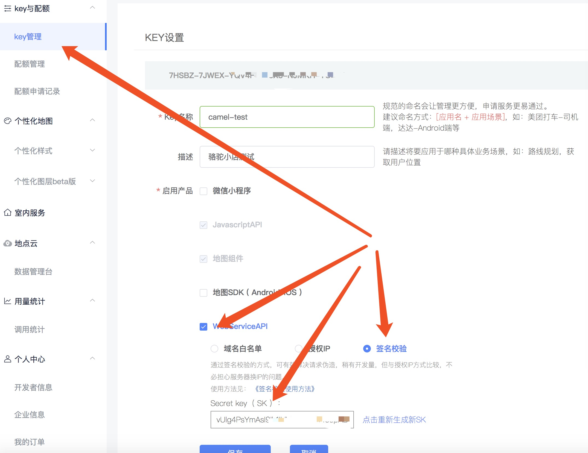

# 第三方服务的配置

开始配置这一块之前，应当已经完成开发环境的配置，并已经做了一些基本的业务操作，如在管理后台添加商品，或者在小程序浏览商品等。因为我们已经假定本文档的读者已经比较熟悉`camel-store`了。

> 因为这一块的配置和生产服的配置是一样的，所以独立出来了。

## 腾讯位置服务（腾讯地图LBS）

前往[腾讯位置服务](https://lbs.qq.com/index.html)注册一个账号，个人也可。

在“key与配额”中创建新密钥（key），之后，打开该key的配置界面，在“启用产品”中勾选“WebServiceAPI”，并选择“签名校验”的安全方案。如下图：



然后把上图的 KEY 和 Secret key（ SK ）配置到 `local.py` 文件，如下：

```
#腾讯地图api KEY
TENCENT_LBS_KEY = '7HSBZ-7JWEX-*****-*****-*****-YUBTJ'
TENCENT_LBS_SK = 'vUlg4PsYm*****h1IHVBRUlZmj4*****'
```

## 小程序的基础配置

小程序 APPID：每个小程序的唯一标识，不可变更；
小程序密钥：查看流程：打开微信小程序后台，点击右侧 “开发选项 - 开发设置” 进行查看；

配置到 `local.py` 文件，如下：

```
WX_CONFIG = {
    'WXAPP_APPID': 'wx**********b1956c',
    'WXAPP_APPSECRET': '882cf1f5e343c45b074375**********',
}
```

## 微信支付配置

需要先去[微信支付](https://pay.weixin.qq.com/)申请，通过审核后，可以拿到商户号和商户Key，配置到 `local.py` 文件，如下：

```
#微信支付相关
WX_PAY_APP_ID = ""
WX_PAY_WXA_APP_ID = "wx**********b1956c"  # 小程序 appid
WX_PAY_API_KEY = "4060ac22342f11e5816000**********"  # 商户 key
WX_PAY_MCH_ID = "12********"  # 商户号
WX_PAY_SUB_MCH_ID = ""
WX_PAY_MCH_CERT = os.path.join(BASE_DIR, "conf/cert_file/********apiclient_cert.pem")  # 商户证书路径
WX_PAY_MCH_KEY = os.path.join(BASE_DIR, "conf/cert_file/********apiclient_key.pem")  # 商户证书私钥路径
WX_PAY_NOTIFY_URL = "http://camelstore.dev.com/api/trade/468468418416846841684a6efaefa/"  # 支付结果通知回调
```

注：一般情况下，`WX_PAY_APP_ID`和`WX_PAY_SUB_MCH_ID`留空即可。

这里要注意一下，`WX_PAY_NOTIFY_URL`需要一个外网域名，所以一般来说，本机开发环境没有办法被外部回调，所以如果在`微信开发工具`测试，只能测试到订单付款页面，付款后因为订单不知道付款状态，所以会一直保持在“待支付”状态。

-----------
至此，基本上能在本机走完全部流程。